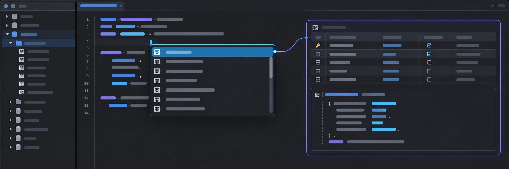
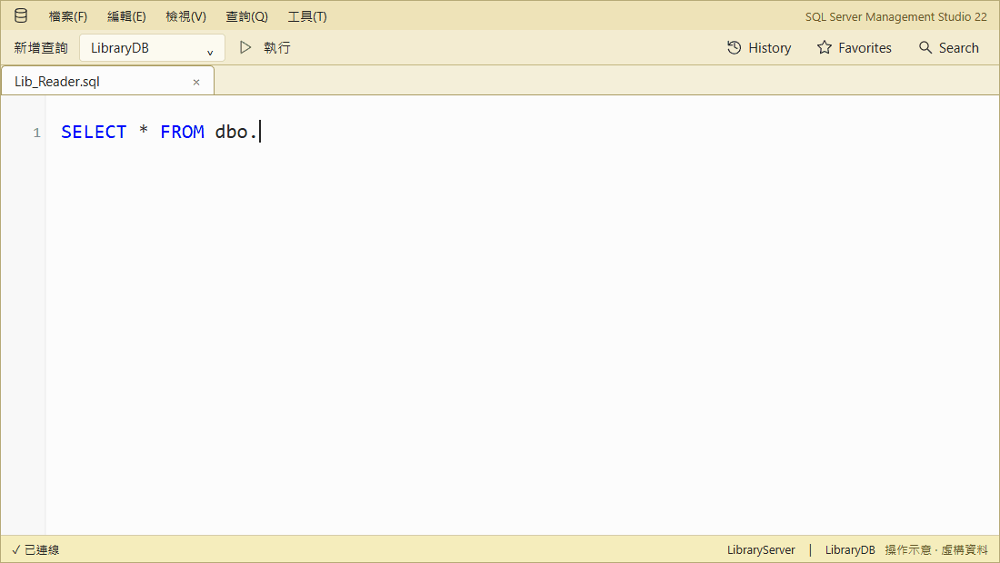
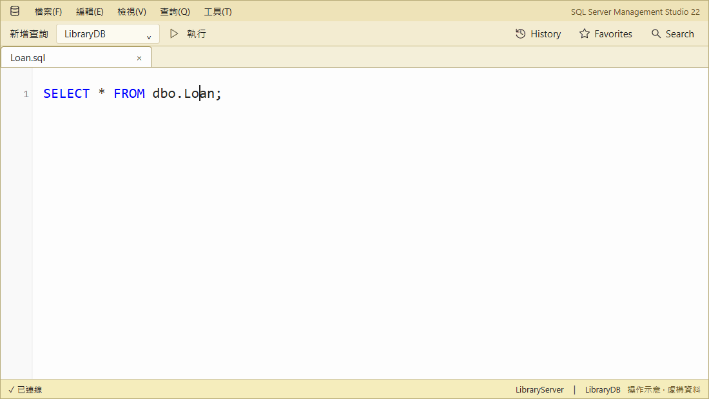
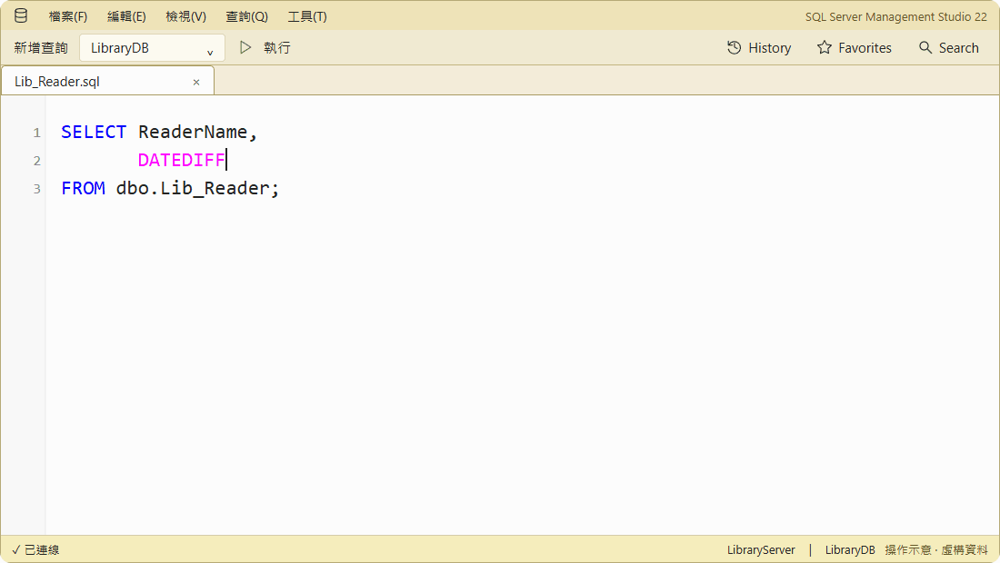
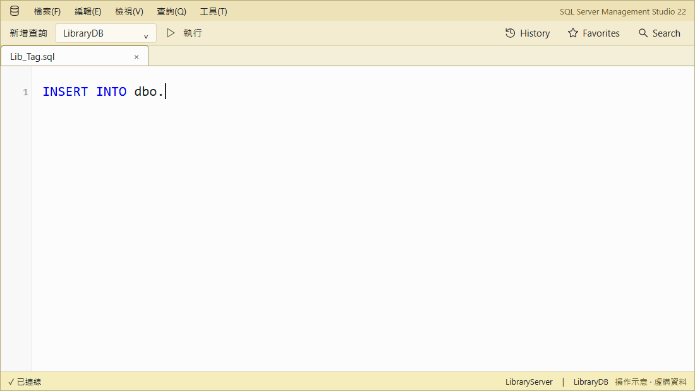
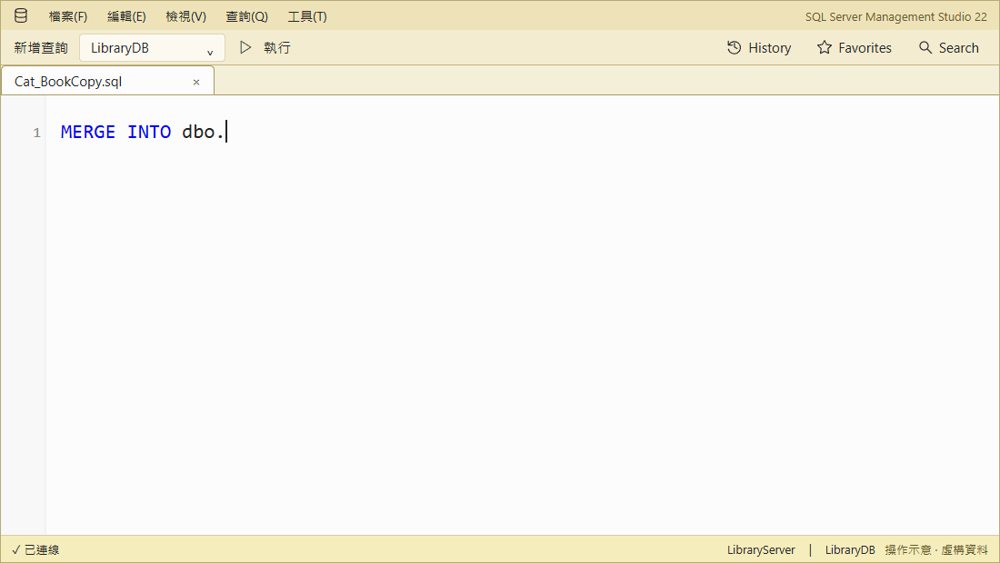
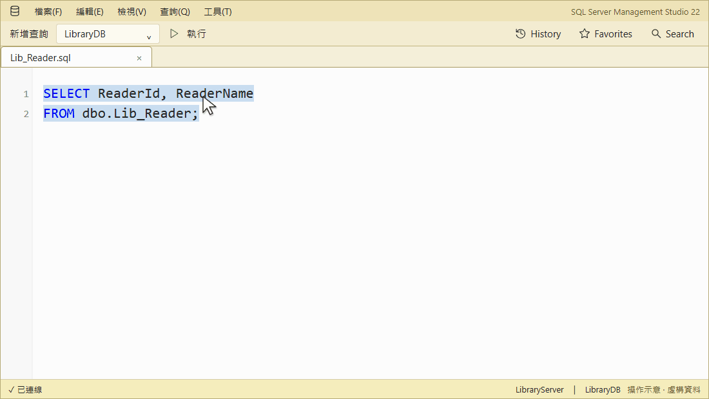
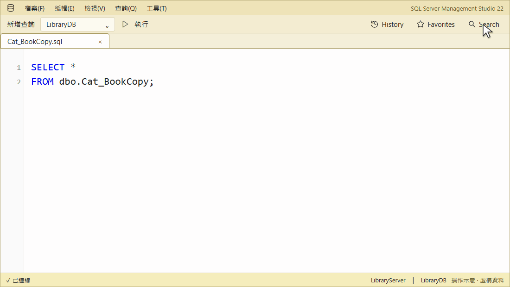
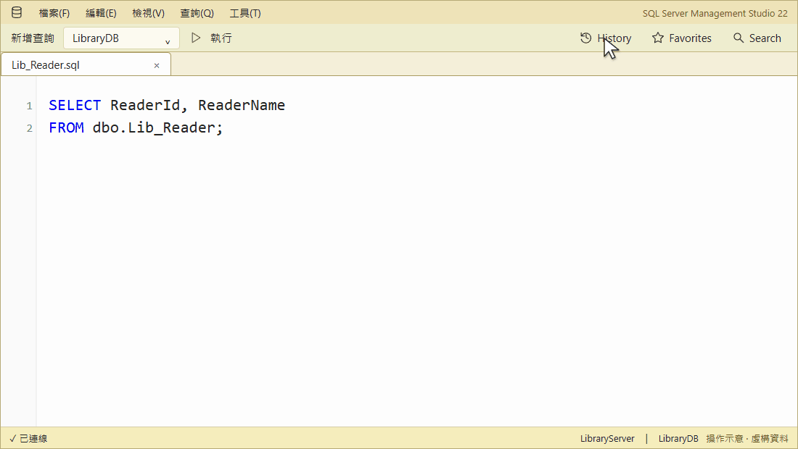

# SqlAssist for SSMS 22

**Complete SQL, inspect objects, and save queries in SSMS 22—locally, with no cloud or AI.**

[繁體中文](README.zh-TW.md)

[Start](docs/getting-started.md) · [Docs](docs/index.md) ·
[Issues](https://github.com/a73013110/SqlAssist.Ssms22/issues)

## Feature tour

Demos are illustrations with fictional data, not recordings.
[Play, pause, or replay them](https://a73013110.github.io/SqlAssist.Ssms22/demos/feature-demos.html).

### Complete SQL and inspect objects

Type `libr` → **Right Arrow** previews columns → **Tab** inserts `Lib_Reader`. Suggestions follow
clauses, aliases, and temp tables.

[PNG](docs/images/completion-preview-demo.png)

In the preview, open **Script** to see the DDL.

[PNG](docs/images/structure-preview-demo.png)

On `Loan`, **F12** opens its full definition without running it.

[PNG](docs/images/f12-definition-demo.png)

### Keep parameter hints on screen

SSMS drops the `DATEDIFF(` hint after Backspace, a click, or an inner call;
SqlAssist brings it back and adds hints for scalar UDFs.

[PNG](docs/images/parameter-hint-demo.png)

### Expand SQL with Tab

**`SELECT *`** → press **Tab** to replace the star with explicit columns.

[PNG](docs/images/expand-star-demo.png)

**`INSERT`** → select `Lib_Tag` to generate columns and typed values, skipping identity.

[PNG](docs/images/insert-template-demo.png)

**`EXEC`** → select `usp_Loan_Count` to insert named arguments and an `OUTPUT` variable.

[PNG](docs/images/execute-template-demo.png)

**`MERGE`** → select `Cat_BookCopy` to generate key matching, `UPDATE`, and `INSERT` clauses.
Replace `dbo.SourceTable` and review both `AND 1 = 0` guards before use.

[PNG](docs/images/merge-template-demo.png)

**`ALTER PROCEDURE`** / **`ALTER FUNCTION`** → select a routine to load its editable definition without running it.

[PNG](docs/images/alter-procedure-demo.png)

[PNG](docs/images/alter-function-demo.png)

### Wrap existing SQL with snippets

Select SQL → **Surround with snippet** → apply `ifb` → edit the condition → **Tab**.

[PNG](docs/images/surround-snippet-demo.png)

### Search database objects

Find `CopyNo` in **Search** and use **›** for the next match. Row data is not searched.

[PNG](docs/images/sql-search-demo.png)

### History and Favorites

Find `Loan` in **History**, save it with **☆**, then reopen it from **Favorites** without running it.

[PNG](docs/images/sql-memory-demo.png)

### Reuse query results

Copy selected cells as an `IN` predicate. The grid menu also builds `#temp`, Markdown,
JSON, and column profiles.

[PNG](docs/images/result-in-demo.png)

## Install

Requires **Windows x64** and **SSMS 22.9.x**.

1. Get `SqlAssist.Ssms22.vsix` from the latest [release](https://github.com/a73013110/SqlAssist.Ssms22/releases).
2. Close SSMS, run the VSIX, and restart; **Tools → SqlAssist** confirms it loaded.

UI language follows SSMS; override it in Settings → SqlAssist → General.

> [!IMPORTANT]
> Keep SSMS IntelliSense on; SqlAssist only suppresses its conflicting auto-list.

> [!WARNING]
> [SSMS does not officially support third-party extensions](https://learn.microsoft.com/en-us/ssms/faq#are-extensions-supported-in-ssms).

## Learn more

⭐ If SqlAssist helps you, please [star it on GitHub](https://github.com/a73013110/SqlAssist.Ssms22) so others can find it.

[Contributing](CLAUDE.md) · [Apache License 2.0](LICENSE)
